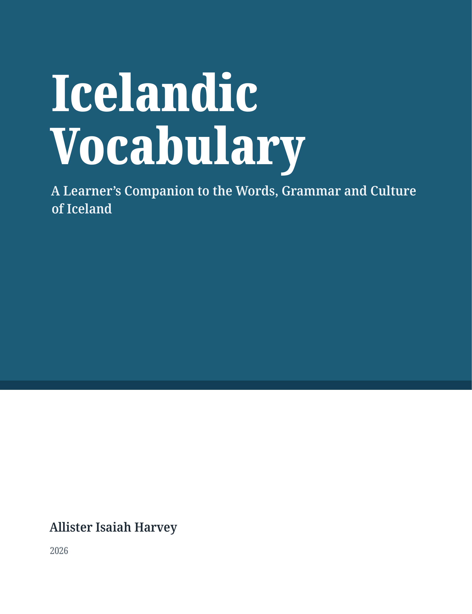

#+TITLE: Frá íslenskum glósum til útgefinnar bókar: /Icelandic Vocabulary/ 🇮🇸📚
#+DATE: <2026-09-30 Wed>
#+FILETAGS: :icelandic:emacs:org-mode:books:
#+DESCRIPTION: Hvernig hrúga af íslenskum námsglósum í Org mode breyttist smám saman í útgefna bók.
#+HERO: images/icelandic-vocabulary-banner.png
#+PROPERTY: TIMEZONE America/Port_of_Spain

* Ég gaf í alvöru út bók

Ég ætlaði mér aldrei að skrifa bók. Ég ætlaði að læra íslensku.

Og samt erum við hér. Bókin mín, /Icelandic Vocabulary/, er nú komin út og fæst á Amazon. Satt að segja finnst mér enn svolítið skrýtið að skrifa þetta. Eitt augnablik var ég að punkta niður glósur fyrir sjálfan mig, og það næsta var ég að horfa á síðu þar sem stóð „útgefin“.

Þetta er sagan af því hvernig það gerðist.

#+CAPTION: Fullbúna bókin

* Af hverju ég byrjaði að læra íslensku

Í upphafi síðasta árs byrjaði ég að læra íslensku. Eftir svo mörg ár í sænskunámi langaði mig að vita meira um rætur sænskunnar, og ég hafði alltaf heyrt að íslenska væri það lifandi tungumál sem stæði næst fornnorrænu.

Þetta var eiginlega allt og sumt. Engin stórfengleg áætlun, bara forvitni um uppruna málsins sem ég kunni fyrir.

* Glósurnar komu fyrst

Ég hef skrifað glósur svo lengi sem ég hef notað Obsidian og Apple Notes. Eftir nokkurn tíma tók ég þó eftir því að ég snerti glósurnar mínar varla í símanum. Þegar ég hugsaði út í það vildi ég miklu frekar /lesa/ glósurnar þar en breyta þeim. Nánast allar glósurnar mínar urðu hvort sem er til í fartölvunni.

Svo ég færði alla glósugerð yfir í fartölvuna og notaði Obsidian. Það var ánægjuleg reynsla, sérstaklega eftir að Bases kom út. En á meðan ég skrifaði þar fann ég stöðugt að ég saknaði Meow-lyklabindinganna minna.

Já, já, ég veit það. Mun fleiri nota Vim-bindingar. Ég veit ekki, Meow finnst mér bara miklu þægilegra, og eini staðurinn þar sem ég get notað það er Emacs. Það var því það sem dró mig til baka.

Af hverju Org en ekki Markdown? Aðallega af því að það er auðveldara að taka glósurnar með sér. Markdown er stutt á mörgum stöðum, en það eru svo mörg /afbrigði/ af því. Eftir því sem ég best veit er aðeins til eitt afbrigði af Org mode, með viðbótum ofan á. Ég get flutt Org út í Markdown ef mig langar til, en ekki á hinn veginn. Org gerir allt sem ég þarf, svo ég hélt mig við það.

Einhvern veginn varð þetta enn eitt Emacs-verkefnið. 😂

* Af hverju ég ákvað að breyta glósunum í bók

Eftir eitt ár og fjóra mánuði í íslenskunámi horfði ég á allar glósurnar sem ég hafði skrifað og hugsaði: /Íslenska er svo fallegt og sögulegt tungumál. Ég vildi að fleiri væru í raun og veru að læra það./

Þá rann það upp fyrir mér. Kannski gæti ég, með því að skrifa bók um íslenskan orðaforða, sýnt fólki ekki aðeins hversu fallegt málið er á að líta, heldur líka hversu stórkostleg menningin á bak við það er í raun og veru.

Það mótaði líka hvers konar bók þetta yrði. Þegar ég sneri mér að íslensku bjóst ég við sams konar aðstoð og ég hafði haft með sænskuna: kennslubókum, orðabókum, léttlestrarbókum. Það sem ég fann voru nokkur frábær hjálpargögn á víð og dreif, en mjög lítið sem leiddi orðaforða, málfræði og menningu saman á einum stað. Þetta er því bókin sem ég vildi að ég hefði átt þegar ég byrjaði.

Ég er enginn íslenskufræðingur, og þessi bók kemur ekki í stað almennilegrar málfræði eða orðabókar. Hún er *tungumálanemandi að skrifa fyrir aðra tungumálanemendur*: það sem hjálpaði /mér/ að skilja og muna.

* Sænska tengingin

Ég læri tungumál með „laddering“-aðferðinni, þar sem maður notar tungumál sem maður kann þegar sem stökkpall yfir í það næsta. Sænskan hjálpaði /gríðarlega/. Mikið af grunnorðaforða germanskra mála er greinilega skylt. Þegar ég rakst á /Ég er heima/ sá ég strax að /heima/ var af sömu ætt og sænska orðið /hemma/. Það sama gildir um /vatn/, /hús/, /bók/, /dagur/ og svo framvegis.

Þetta nær líka lengra en til einstakra orða. Íslensku orðin /föðurbróðir/ og /móðurbróðir/ eru byggð nákvæmlega eins og sænsku orðin /farbror/ og /morbror/, og /föðursystir/ og /móðursystir/ eins og /faster/ og /moster/. Sænskan gerir þetta líka með ömmur og afa í daglegu tali (/farmor/, /mormor/), á meðan Íslendingar segja yfirleitt bara /amma/ og /afi/.

Og svo er það gildran. Sænskan getur fengið mann til að vanmeta beygingafræði íslenskunnar. Sænskan hefur að mestu misst hið forna germanska fallakerfi. Íslenskan hefur ekki gert það.

#+begin_example
Ég sé manninn.
#+end_example

#+begin_example
Ég tala við manninn.
#+end_example

Þar að auki breytast nafnorð eftir falli, tölu, kyni, ákveðni og fleiru. Sami maðurinn verður /maðurinn/ í einni setningu og /manninn/ í annarri. Satt að segja hafði ég átt von á einhverju miklu líkara sænskunni, þar sem maðurinn fær sama form í báðum setningunum:

#+begin_example
Jag ser mannen.
Jag pratar med mannen.
#+end_example

Til að byrja með gefur sænskan manni orðaforðann ókeypis en skapar um leið rangar væntingar um hvernig þessi orð haga sér málfræðilega. Þessi spenna var nógu áhugaverð til þess að ég gaf henni stað í bókinni: „Swedish Connection“-rammarnir, sem sýna hvar sænskan hjálpar og hvar hún fær mann lúmskt til að hrasa.

* Hlutir sem komu mér á óvart við skriftirnar

Eitt af því sem kom mest á óvart var hversu auðvelt er að sníða Org til: LaTeX fyrir PDF-skjölin og CSS fyrir vef- og ePub-útgáfurnar. Ég hafði búist við að þurfa að glíma miklu meira við verkfærin en raunin varð.

Þegar ég ákvað fyrst að gefa bókina út byrjaði ég í Apple Pages, því það er ókeypis og maður getur breytt stílnum á einu atriði og fengið það uppfært alls staðar. Það sem fékk mig til að skipta yfir í Emacs og Org mode var miklu minna háleitt: ég vann mikið í bókinni á kvöldin, og hvíti bakgrunnurinn fór illa í augun á mér, jafnvel þegar kveikt var á Night Shift í macOS.

Það er mjög góð tilfinning að skrifa í ritli sem maður stjórnar sjálfur, og að skrifa í Org mode lætur mig líka finna að ég stjórni öllu ferlinu.

* Hvernig ég bjó bókina í raun til

Þá er það tæknilegi hlutinn. Öll bókin er í Git-geymslu, ein Org-skrá fyrir hvern kafla, sett saman af einni =book.org= með =#+include=-línum:

#+begin_src org
,* Getting Started

,#+include: "chapters/pronunciation.org" :minlevel 2
,#+include: "chapters/grammar-at-a-glance.org" :minlevel 2
,#+include: "chapters/greetings-and-everyday-phrases.org" :minlevel 2
#+end_src

Með =:minlevel 2= verður efsta fyrirsögn hvers kafla að LaTeX-skipuninni =\chapter= undir viðkomandi =\part=. Kaflarnir eru 22 í sex hlutum, og ráðin, viðvaranirnar, málfræðiathugasemdirnar, menningarathugasemdirnar og Swedish Connection-rammarnir eru allt saman bara sérstakar Org-blokkir (=#+begin_swedish= og svo framvegis) sem ég sníð til í formálanum (preamble) og CSS-skránni.

Ferlið lítur svona út:

#+begin_example
                 ┌──→ LaTeX (XeLaTeX) ──→ PDF ──→ KDP
Org files ───────┤
                 └──→ HTML ──→ Pandoc ──→ EPUB
#+end_example

Ein skipun býr til allt:

#+begin_src sh
emacs --batch -l publish.el -f book-publish-all
#+end_src

Ég skrifaði líka lítið Python-forskrift sem býr til æfingarnar aftast í hverjum kafla, ásamt svarlyklinum og orðalistanum, beint úr orðaforðatöflum kaflanna sjálfra. Það þýðir að ég get ekki gleymt að bæta nýju orði í orðalistann. Einhvern veginn varð þetta /enn eitt/ Emacs-verkefnið, og svo Python-verkefni.

** IPA-sagan

Það eina sem raunverulega angraði mig var að fá *IPA* til að virka. Þar fóru hlutirnir að verða dálítið fáránlegir. Á endanum fólst bragðið í því að hætta að líta á IPA sem texta og meðhöndla það sem sérstakt fyrirbæri. Ég skilgreindi mína eigin tegund Org-tengla, svo ég get skrifað =[[ipa:ˈθraʊstʏr]]= hvar sem er og látið það flytjast rétt út á hvert snið:

#+begin_src emacs-lisp
(org-link-set-parameters
 "ipa"
 :export (lambda (path desc backend)
           (cond
            ((org-export-derived-backend-p backend 'latex) (format "\\ipa{%s}" path))
            ((org-export-derived-backend-p backend 'html) (format "%s" path))
            (t path))))
#+end_src

Í LaTeX skiptir =\ipa= bara yfir í Doulos SIL, sem hefur táknin sem ég þurfti:

#+begin_src latex
\newfontfamily\ipaFont{DoulosSIL-Regular}[Path=\doulosdir, Extension=.ttf]
\DeclareRobustCommand{\ipa}[1]{{\ipaFont #1}}
#+end_src

Og svo hitt vandamálið: meginmálsletrið, Noto Serif, vantar örina → sem ég nota fyrir myndir eins og „X → Y“, svo ég þurfti að bæta við varaletri, annars hvarf hún þegjandi og hljóðalaust úr PDF-skjalinu. Þetta eru þessi örsmáu atriði sem maður uppgötvar aðeins þegar maður situr og rýnir í prófarkaeintak. En einhvern veginn tókst mér að fá öll tákn til að birtast.

* Að gefa hana út var allt önnur upplifun

Satt að segja gerði Amazon mér mjög auðvelt að gefa bókina út. KDP leyfir þér meira að segja að velja hvort þú beitir DRM, sem þýðir að enginn þarf að læsa bókinni sinni ef viðkomandi vill frekar að lesendur sæki hana og nýti eins og þeim þykir best.

Þegar ég skrifaði bókina fannst mér ég vera rithöfundur. Þegar ég smellti á „Gefa út“ gerði ég mér grein fyrir því að ég hafði í raun búið til bók.

* Hvað er í /Icelandic Vocabulary/

/Icelandic Vocabulary: A Learner's Companion to the Words, Grammar and Culture of Iceland/ er fyrir alla sem tala ensku og vilja byggja upp nytsaman íslenskan orðaforða, hvort sem þú ert algjör byrjandi, ert að taka upp þráðinn að nýju eða ætlar í ferð til Íslands. Þú þarft ekki að kunna sænsku, en ef þú gerir það sýna Swedish Connection-rammarnir þér hvernig þú getur nýtt hana.

Henni er skipt í sex hluta:

- *Getting Started*: framburður, stutt yfirlit yfir þá málfræði sem þú þarft, og kveðjur og daglegar setningar
- *People and Everyday Life*: fjölskylda, vinna, skóli, líkaminn og heilsa
- *Home and Daily Living*: heimilið, föt, matur og drykkur, tími, tölur og litir
- *Nature and the Outdoors*: dýr, landbúnaður, landslagið og saga Íslands
- *Recreation, Culture and Entertainment*: áhugamál, íþróttir, hátíðir, listir og fjölmiðlar
- *Travel and the Wider World*: samgöngur, ferðalög, lönd og þjóðerni

Hver kafli hefst á inngangi, setur orðaforðann fram í þemaskiptum töflum, sýnir orðin í notkun í dæmasetningum og stuttu samtali, og endar á æfingum. Aftast eru sagnatöflur, beygingartöflur, leiðarvísir um forsetningar og föll, listi yfir málfræðihugtök á einfaldri ensku, svarlykill og íslensk-ensk orðaskrá.

* Hvað er næst?

Næsta markmið mitt er að smíða eitthvað sem gerir mér kleift að hafa Org-skrárnar mínar með mér hvert sem ég fer. Emacs verður alltaf á öllum tækjunum mínum, svo lengi sem það getur verið það. En fyrir þá staði þar sem það getur það ekki, tja... vil ég samt tryggja að ég komist í glósurnar mínar.

Ég geri mér líka fulla grein fyrir því að ég er enn að læra og að villur munu leynast í bókinni. Ef þú rekst á villu þætti mér mjög vænt um að heyra af henni, og þá rataði hún í næstu útgáfu.

Það að bókin sé komin út þýðir heldur ekki að íslenskunáminu sé lokið. Ég er enn að læra. Þessi bók er einfaldlega skrá yfir það hversu langt ég hef komist hingað til.

* Hvar hægt er að fá hana

/Icelandic Vocabulary/ fæst nú á Amazon.

[[https://www.amazon.com/dp/B0HLLBTCXL][Kaupa /Icelandic Vocabulary/]]

Ég þakka öllum sem hvöttu mig áfram á meðan ég vann að henni: kennurum, vinum, fjölskyldu og öllum hinum tungumálaáhugamönnunum, en spurningar þeirra, leiðréttingar og góða skap áttu þátt í að móta þessar síður. ❤️
